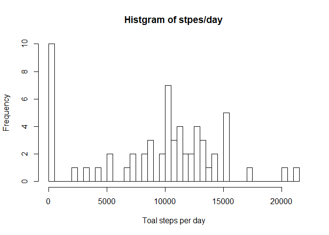
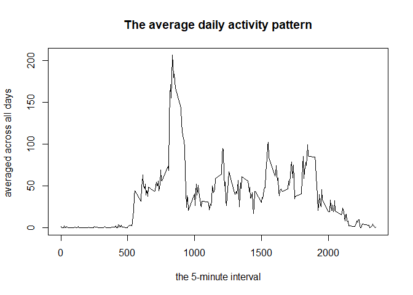
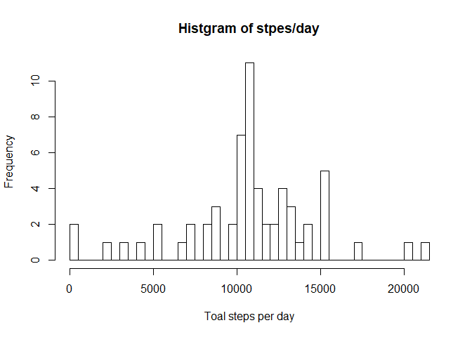
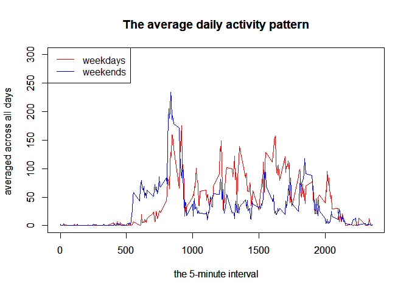

# Reproducible Research: Peer Assessment 1

## Loading necessary  libraries
I use following lirbraries.  
* dplyr
* lubridate

```r
library(dplyr)
```

```
## 
## Attaching package: 'dplyr'
```

```
## The following objects are masked from 'package:stats':
## 
##     filter, lag
```

```
## The following objects are masked from 'package:base':
## 
##     intersect, setdiff, setequal, union
```

```r
library(lubridate)
```

```
## 
## Attaching package: 'lubridate'
```

```
## The following object is masked from 'package:base':
## 
##     date
```


## Loading and preprocessing the data
Loading surce data, and convert 'interval' value to time value.

```r
activity_csv <- read.csv(unzip("activity.zip"))
activity_csv <- mutate(activity_csv, time = sprintf("%02d:%02d", interval%/%100, interval%%100))
activity_csv <- mutate(activity_csv, datetime_str = paste(activity_csv$date, " ", activity_csv$time))
activity_csv <- mutate(activity_csv, 
                       datetime = as.POSIXct(strptime(activity_csv$datetime_str, "%Y-%m-%d %H:%M")))
str(activity_csv)
```

```
## 'data.frame':	17568 obs. of  6 variables:
##  $ steps       : int  NA NA NA NA NA NA NA NA NA NA ...
##  $ date        : Factor w/ 61 levels "2012-10-01","2012-10-02",..: 1 1 1 1 1 1 1 1 1 1 ...
##  $ interval    : int  0 5 10 15 20 25 30 35 40 45 ...
##  $ time        : chr  "00:00" "00:05" "00:10" "00:15" ...
##  $ datetime_str: chr  "2012-10-01   00:00" "2012-10-01   00:05" "2012-10-01   00:10" "2012-10-01   00:15" ...
##  $ datetime    : POSIXct, format: "2012-10-01 00:00:00" "2012-10-01 00:05:00" ...
```

```r
head(activity_csv)
```

```
##   steps       date interval  time       datetime_str            datetime
## 1    NA 2012-10-01        0 00:00 2012-10-01   00:00 2012-10-01 00:00:00
## 2    NA 2012-10-01        5 00:05 2012-10-01   00:05 2012-10-01 00:05:00
## 3    NA 2012-10-01       10 00:10 2012-10-01   00:10 2012-10-01 00:10:00
## 4    NA 2012-10-01       15 00:15 2012-10-01   00:15 2012-10-01 00:15:00
## 5    NA 2012-10-01       20 00:20 2012-10-01   00:20 2012-10-01 00:20:00
## 6    NA 2012-10-01       25 00:25 2012-10-01   00:25 2012-10-01 00:25:00
```

```r
summary(activity_csv)
```

```
##      steps                date          interval          time          
##  Min.   :  0.00   2012-10-01:  288   Min.   :   0.0   Length:17568      
##  1st Qu.:  0.00   2012-10-02:  288   1st Qu.: 588.8   Class :character  
##  Median :  0.00   2012-10-03:  288   Median :1177.5   Mode  :character  
##  Mean   : 37.38   2012-10-04:  288   Mean   :1177.5                     
##  3rd Qu.: 12.00   2012-10-05:  288   3rd Qu.:1766.2                     
##  Max.   :806.00   2012-10-06:  288   Max.   :2355.0                     
##  NA's   :2304     (Other)   :15840                                      
##  datetime_str          datetime                  
##  Length:17568       Min.   :2012-10-01 00:00:00  
##  Class :character   1st Qu.:2012-10-16 05:58:45  
##  Mode  :character   Median :2012-10-31 11:57:30  
##                     Mean   :2012-10-31 11:57:30  
##                     3rd Qu.:2012-11-15 17:56:15  
##                     Max.   :2012-11-30 23:55:00  
## 
```


## What is mean total number of steps taken per day?

### Calculate total steps per day.
Calculate total step per day, and show summary informations.

```r
# summarise data by day
summarise_data <- group_by(activity_csv, date) %>% summarise(steps = sum(steps, na.rm = TRUE))
str(summarise_data)
```

```
## Classes 'tbl_df', 'tbl' and 'data.frame':	61 obs. of  2 variables:
##  $ date : Factor w/ 61 levels "2012-10-01","2012-10-02",..: 1 2 3 4 5 6 7 8 9 10 ...
##  $ steps: int  0 126 11352 12116 13294 15420 11015 0 12811 9900 ...
```

```r
summary(summarise_data)
```

```
##          date        steps      
##  2012-10-01: 1   Min.   :    0  
##  2012-10-02: 1   1st Qu.: 6778  
##  2012-10-03: 1   Median :10395  
##  2012-10-04: 1   Mean   : 9354  
##  2012-10-05: 1   3rd Qu.:12811  
##  2012-10-06: 1   Max.   :21194  
##  (Other)   :55
```

```r
head(summarise_data)
```

```
## # A tibble: 6 × 2
##         date steps
##       <fctr> <int>
## 1 2012-10-01     0
## 2 2012-10-02   126
## 3 2012-10-03 11352
## 4 2012-10-04 12116
## 5 2012-10-05 13294
## 6 2012-10-06 15420
```

### Show histgram of steps/day
Show hishgram of steps/day by plot().

```r
hist(summarise_data$steps, 
     breaks = 50,
     xlab = "Toal steps per day", 
     ylab = "Frequency", 
     main = "Histgram of stpes/day")
```

<!-- -->

### Calclurate mean and median of total steps/day
Calculate and print mean value and median value of total steps/day.

```r
summary(summarise_data$steps)
```

```
##    Min. 1st Qu.  Median    Mean 3rd Qu.    Max. 
##       0    6778   10400    9354   12810   21190
```

```r
sprintf("median : %.3f", median(summarise_data$steps))
```

```
## [1] "median : 10395.000"
```

```r
sprintf("mean   : %.3f", mean(summarise_data$steps))
```

```
## [1] "mean   : 9354.230"
```


## What is the average daily activity pattern?
### Calculate average value
Calculate average value, grouping by 'interval' column.
And show summary informations.

```r
average_daily_data <- group_by(activity_csv, interval, time) %>% summarise(steps = mean(steps, na.rm = TRUE))
str(average_daily_data)
```

```
## Classes 'grouped_df', 'tbl_df', 'tbl' and 'data.frame':	288 obs. of  3 variables:
##  $ interval: int  0 5 10 15 20 25 30 35 40 45 ...
##  $ time    : chr  "00:00" "00:05" "00:10" "00:15" ...
##  $ steps   : num  1.717 0.3396 0.1321 0.1509 0.0755 ...
##  - attr(*, "vars")=List of 1
##   ..$ : symbol interval
##  - attr(*, "drop")= logi TRUE
```

```r
summary(average_daily_data)
```

```
##     interval          time               steps        
##  Min.   :   0.0   Length:288         Min.   :  0.000  
##  1st Qu.: 588.8   Class :character   1st Qu.:  2.486  
##  Median :1177.5   Mode  :character   Median : 34.113  
##  Mean   :1177.5                      Mean   : 37.383  
##  3rd Qu.:1766.2                      3rd Qu.: 52.835  
##  Max.   :2355.0                      Max.   :206.170
```

```r
head(average_daily_data)
```

```
## Source: local data frame [6 x 3]
## Groups: interval [6]
## 
##   interval  time     steps
##      <int> <chr>     <dbl>
## 1        0 00:00 1.7169811
## 2        5 00:05 0.3396226
## 3       10 00:10 0.1320755
## 4       15 00:15 0.1509434
## 5       20 00:20 0.0754717
## 6       25 00:25 2.0943396
```

### Plot activity pattern
Show line plot by plot().

```r
plot(x = average_daily_data$interval, y = average_daily_data$steps,
     type = "l",
     xlab = "the 5-minute interval",
     ylab = "averaged across all days ",
     main = "The average daily activity pattern"
     )
```

<!-- -->

Show interval that have maximum steps. 

```r
filter(average_daily_data, steps == max(average_daily_data$steps))
```

```
## Source: local data frame [1 x 3]
## Groups: interval [1]
## 
##   interval  time    steps
##      <int> <chr>    <dbl>
## 1      835 08:35 206.1698
```


## Imputing missing values

### Compute missing value's count.
Compute missing value's count.

```r
sum(is.na(activity_csv))
```

```
## [1] 2304
```

### Strategy for filling in all of the missing values in the dataset.
I use mean value of all days (expect NA day) for substitution value of missing value.

```r
filling_data  <- group_by(activity_csv, date) 
filling_data$steps[is.na(filling_data$steps)] = mean(filling_data$steps, na.rm = TRUE)
summary(filling_data)
```

```
##      steps                date          interval          time          
##  Min.   :  0.00   2012-10-01:  288   Min.   :   0.0   Length:17568      
##  1st Qu.:  0.00   2012-10-02:  288   1st Qu.: 588.8   Class :character  
##  Median :  0.00   2012-10-03:  288   Median :1177.5   Mode  :character  
##  Mean   : 37.38   2012-10-04:  288   Mean   :1177.5                     
##  3rd Qu.: 37.38   2012-10-05:  288   3rd Qu.:1766.2                     
##  Max.   :806.00   2012-10-06:  288   Max.   :2355.0                     
##                   (Other)   :15840                                      
##  datetime_str          datetime                  
##  Length:17568       Min.   :2012-10-01 00:00:00  
##  Class :character   1st Qu.:2012-10-16 05:58:45  
##  Mode  :character   Median :2012-10-31 11:57:30  
##                     Mean   :2012-10-31 11:57:30  
##                     3rd Qu.:2012-11-15 17:56:15  
##                     Max.   :2012-11-30 23:55:00  
## 
```

Show histgram based in filling missing values, and calculate median, mean, differences.

```r
summarise_data2 <- group_by(filling_data, date) %>% summarise(steps = sum(steps, na.rm = TRUE))
hist(summarise_data2$steps, 
     breaks = 50,
     xlab = "Toal steps per day", 
     ylab = "Frequency", 
     main = "Histgram of stpes/day")
```

<!-- -->

```r
summary(summarise_data2$steps)
```

```
##    Min. 1st Qu.  Median    Mean 3rd Qu.    Max. 
##      41    9819   10770   10770   12810   21190
```

```r
sprintf("median : %.3f", median(summarise_data2$steps))
```

```
## [1] "median : 10766.189"
```

```r
sprintf("mean   : %.3f", mean(summarise_data2$steps))
```

```
## [1] "mean   : 10766.189"
```

```r
sprintf("differ median : %.3f", median(summarise_data2$steps) - median(summarise_data$steps))
```

```
## [1] "differ median : 371.189"
```

```r
sprintf("differ mean   : %.3f", mean(summarise_data2$steps) - mean(summarise_data$steps))
```

```
## [1] "differ mean   : 1411.959"
```


## Are there differences in activity patterns between weekdays and weekends?
Create new data.frame that have new  factor variable.

```r
activity_csv_w_weekday <- mutate(activity_csv, 
                                 weekdays = factor(if_else(wday(activity_csv$datetime) %in% c(1,7), "weekdays", "weekends")))
average_daily_data2 <- group_by(activity_csv_w_weekday, interval, time, weekdays) %>% summarise(steps = mean(steps, na.rm = TRUE))
str(average_daily_data2)
```

```
## Classes 'grouped_df', 'tbl_df', 'tbl' and 'data.frame':	576 obs. of  4 variables:
##  $ interval: int  0 0 5 5 10 10 15 15 20 20 ...
##  $ time    : chr  "00:00" "00:00" "00:05" "00:05" ...
##  $ weekdays: Factor w/ 2 levels "weekdays","weekends": 1 2 1 2 1 2 1 2 1 2 ...
##  $ steps   : num  0 2.333 0 0.462 0 ...
##  - attr(*, "vars")=List of 2
##   ..$ : symbol interval
##   ..$ : symbol time
##  - attr(*, "drop")= logi TRUE
```

```r
summary(average_daily_data2)
```

```
##     interval          time               weekdays       steps        
##  Min.   :   0.0   Length:576         weekdays:288   Min.   :  0.000  
##  1st Qu.: 588.8   Class :character   weekends:288   1st Qu.:  1.854  
##  Median :1177.5   Mode  :character                  Median : 26.295  
##  Mean   :1177.5                                     Mean   : 39.208  
##  3rd Qu.:1766.2                                     3rd Qu.: 62.321  
##  Max.   :2355.0                                     Max.   :234.103
```

```r
head(average_daily_data2)
```

```
## Source: local data frame [6 x 4]
## Groups: interval, time [3]
## 
##   interval  time weekdays     steps
##      <int> <chr>   <fctr>     <dbl>
## 1        0 00:00 weekdays 0.0000000
## 2        0 00:00 weekends 2.3333333
## 3        5 00:05 weekdays 0.0000000
## 4        5 00:05 weekends 0.4615385
## 5       10 00:10 weekdays 0.0000000
## 6       10 00:10 weekends 0.1794872
```

Plot line plot weekdays and weekends.

```r
step_data_weekdays <- filter(average_daily_data2, weekdays == "weekdays")
step_data_weekends <- filter(average_daily_data2, weekdays == "weekends")
plot(x = step_data_weekdays$interval, y = step_data_weekdays$steps, 
     type = "l",
     xlab = "the 5-minute interval",
     ylab = "averaged across all days ",
     main = "The average daily activity pattern", 
     col = "red",
     ylim = c(0, 300)
     )
par(new = T)
plot(x = step_data_weekends$interval, y = step_data_weekends$steps, 
     type = "l",
     xlab = "the 5-minute interval",
     ylab = "averaged across all days ",
     main = "The average daily activity pattern", 
     col = "blue",
     ylim = c(0, 300)
     )
legend("topleft", legend=c("weekdays", "weekends"), lty=c(1, 1), col=c("red", "blue"))
```

<!-- -->
